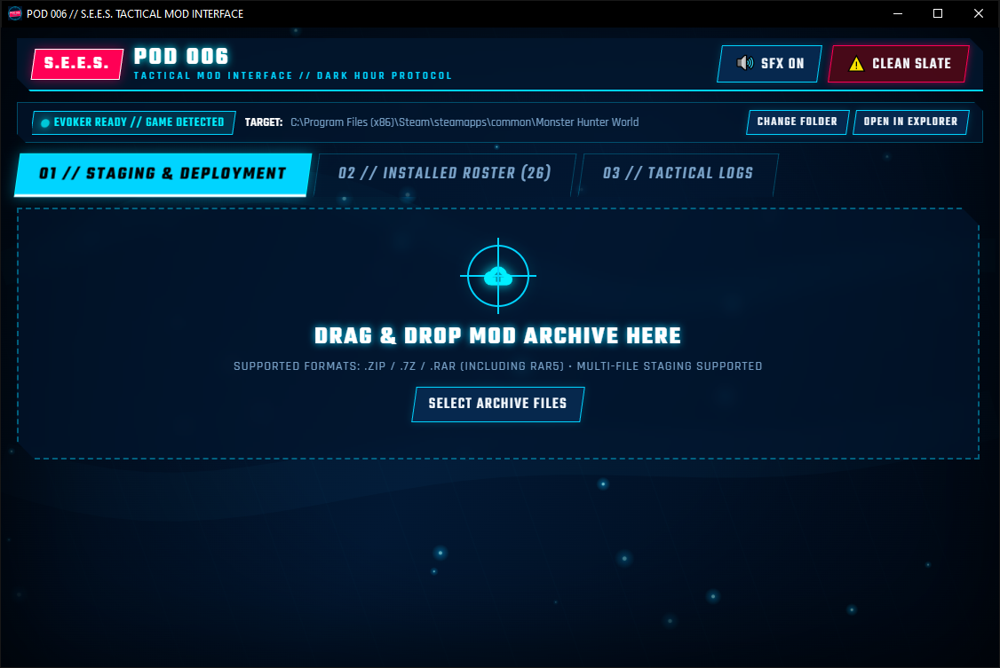
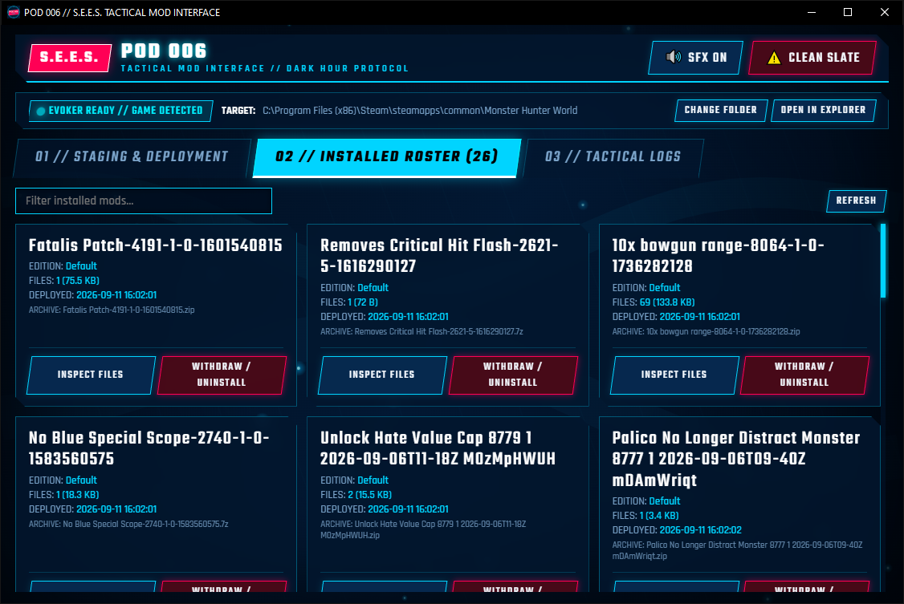

# Pod 006 // Monster Hunter World Mod Manager (P3R Theme)

Pod 006 is a dedicated desktop mod manager for Monster Hunter: World, designed with a Persona 3 Reload tactical UI aesthetic. It streamlines mod staging, conflict resolution, archive extraction, and uninstallation with automated file tracking.

## Features

* Persona 3 Reload inspired tactical interface with custom visual elements and audio feedback.
* Automatic game directory detection via Steam registry and common install paths.
* Archive support for .zip, .7z, and .rar (including RAR5) formats via bundled 7-Zip engine.
* Multi-mod batch staging with interactive conflict resolution and variant selection.
* Layer-aware manifest tracking for clean, surgical mod withdrawals without deleting shared files.
* Clean Slate routine to completely reset nativePC and restore vanilla file integrity.
* Search and filtering across installed mods.
* Standalone single-executable distribution with zero external runtime dependencies.

## Installation

Pod 006 is distributed as a standalone Windows executable.

1. Download the latest Pod-006.exe from the Releases page.
2. Place Pod-006.exe in any folder of your choice and launch it.
3. Pod 006 will automatically detect your Monster Hunter: World installation. If installed in a non-standard directory, set the target folder manually using Change Folder.

## Usage

1. Staging: Drag and drop one or more mod archives into the drop zone, or use Select Archive Files.
2. Conflict Review: If multiple archives contain conflicting files or multiple variant options, select your preferred choices in the blueprint modal.
3. Deployment: Confirm the installation to deploy files into your game nativePC directory.
4. Managing: Switch to Tab 02 (Installed Roster) to view installed mods, inspect individual files, or withdraw/uninstall any mod safely.

## Building from Source

Requirements: Python 3.10+ on Windows 10/11.

1. Clone the repository:
   git clone https://github.com/Velgoh/MHW-Mod-Manager-P3R-Themed.git
   cd MHW-Mod-Manager-P3R-Themed

2. Install dependencies:
   pip install -r requirements.txt

3. Run from source:
   python pod006/app.py

4. Build standalone executable:
   pyinstaller pod006.spec

The compiled binary will be placed in the dist/ folder.

## License & Copyright

This project is open source and licensed under the MIT License. You are free to use, modify, distribute, and build upon this software, provided that proper credit and attribution are given to the original author (Velgoh).

Support: Glory to mankind.
